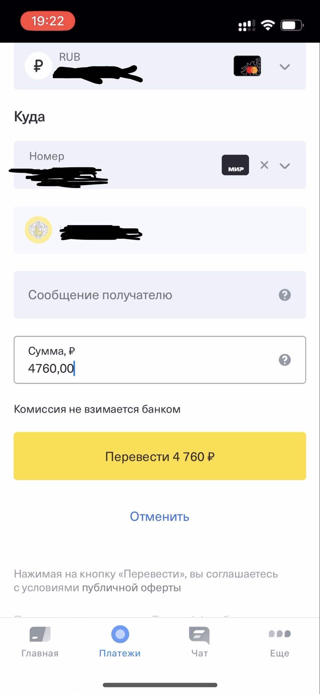
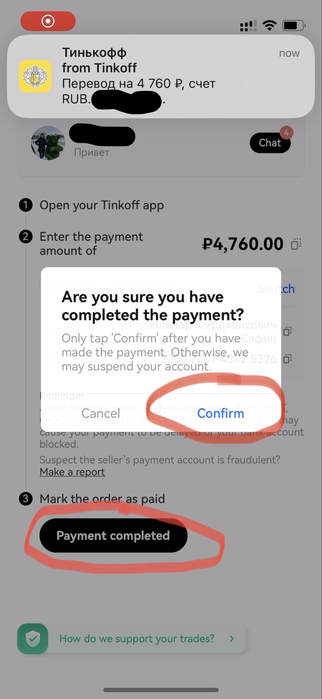
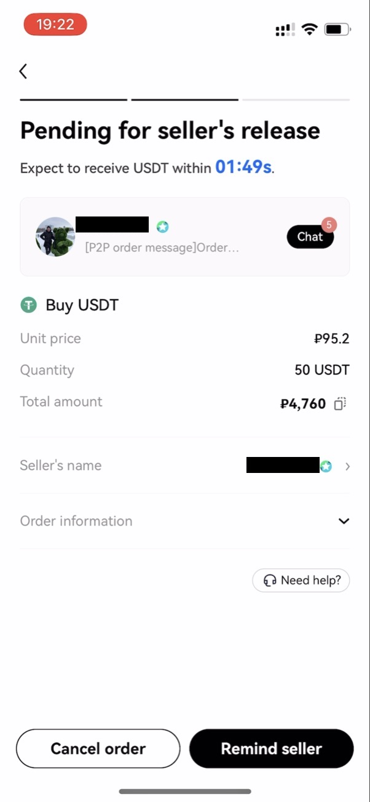

# Переводы рублей в евро/доллары криптой
Оказывается, крипта это не только скам, бинарные опционы и отмыв преступных денег, заработанных с продажи почек детей.
В этом смысле она ничем не лучше и не хуже налички.

В то же время крипта может помочь:
1. Переводить грязные русские деньги между банком РФ и ЕС с суммарной комиссией в 1%
2. Защитить деньги от самоуправства банков (променяв этот риск на риски мошенничества и угрозы компьютерной безопасности)
3. Побаловаться в криптоинвестора, чтобы накопить на чёрный гелик

Здесь я расскажу про переводы: как купить USDT за рубли на криптобирже
через p2p, а затем аналогично продать их за евро/доллары/шведские кроны на Revolut/Wise/WebMoney.

Ни черта непонятно? Прекрасно, месяц назад для меня это тоже звучало как заклинание. 

Пойдём разберёмся с матчастью.

## Матчасть
О том, как устроен блокчейн, уже прекрасно [рассказал Вастрик](https://vas3k.blog/blog/blockchain/).

Я же сосредоточусь на том, что необходимо знать для переводов валюты криптой за границу: о криптобиржах и
stablecoins (стейблкоинах)

### Криптобиржа
Когда биткоин только появился, а никаких криптобирж не было, люди майнили биткоин и пересылали его друг другу лично
на кошельки, в обмен на деньги 
или [пиццу](https://vc.ru/crypto/426609-pervaya-pokupka-piccy-za-bitkoin-byla-rovno-12-let-nazad).
Всё бы хорошо, только вот затруднительно каждый раз искать человека, которому ты доверяешь, 
кто хочет купить именно 0.001 биткоин и отдаст за него справедливую цену, — точно так же как искать среди друзей, 
кто хочет купить у вас акции Apple или Сбербанка. 

Как и в мире акций, в мире крипты эту проблему решили с помощью бирж:
места, куда ты можешь прийти с деньгами, а уйти ~~без~~ с биткоином, или наоборот.
Биржа заводит свой аккаунт с логином и паролем для каждого пользователя и
создаёт для вас биржевой криптокошелёк (аналог счёта в банке). 
Как и в банк, вы можете залогиниться через приложение или браузер.

В целом, крупным биржам можно доверять _почти_ как банкам, однако,
уже известен случай [банкротства криптобиржи FTX](https://ru.wikipedia.org/wiki/FTX_(компания))
с потерей средств держателей счетов. Поэтому:
- Пользуйтесь крупными проверенными биржами 
  ([binance](https://www.binance.com/), [bybit](https://www.bybit.com/), [okx](https://www.okx.com))
- Начните с тестового перевода маленькой суммы, чтобы отработать процесс
- Не храните деньги на бирже. Перевели, вывели.

### Stablecoins: USDT, USDC, DAI (криптодоллары)
Вероятно, вы слышали про биткоин и эфир, что они стоят невероятных денег, но с ними есть одна проблема — они нестабильны.
Сегодня вы купили биткоинов на тысячу рублей, через час они стали стоить две, а через день — сто.

Тогда люди придумали стейблкоины — криптоденьги, равные по своему курсу реальной валюте.
На сегодняшний день юзабельны только стейблкоины долларов, даже криптоевро ещё не получил массового распространения.

Самых известных криптодолларов три: USDC, USDT и DAI.
Первые два почти идентичны и активно используются биржами для ввода/вывода денег — их разменивают на реальные доллары.
Третий нас интересовать не будет, т.к. большинство бирж его для этих целей не используют.

## Перевод денег криптой
Поздравляю, вы осилили матчасть! Дальше будет много практики и скриншотов.

В целом процесс перевода денег через крипту выглядит следующим образом:
- Регистрируемся на бирже и проходим процедуры проверки личности
- Покупаем криптодоллары за ненужные деньги
- Покупаем нужные деньги за криптодоллары, либо выводим евро с помощью криптокарты биржи

### Выбор биржи
При выборе биржи я выделил такие ограничивающие условия:
- Биржу устраивает цвет вашего паспорта
- Биржа даёт торговать за рубли
- Биржа даёт возможность вывести деньги на нужный вам банк
- Вам нравится приложенька

Мне нравятся три биржи:
- [bybit](https://www.bybit.com/invite?ref=P6XV6P) —
  умеет рубли, маленькие комиссии, для жителей Европы может выпустить банковскую карту,
  с которой удобно пополнять Revolut. Номинант на самый неудобный и некрасивый интерфейс среди бирж.
- [binance](https://www.binance.info/en/activity/referral-entry/CPA/incremental?ref=CPA_00XERYC5CX) —
  умеет рубли, средние комиссии, для жителей Европы может выпустить банковскую карту,
  с которой удобно пополнять Revolut. Интерфейс ± на уровне bybit.
  - Для жителей Грузии будет бонусом, что оффлайн-криптообменники (где можно за крипту получить наличные доллары)
    обычно имеют аккаунт на бинансе, благодаря чему вы не сэкономите на внутрибиржевом переводе.
- [okx](https://okx.com/join/40093369) — умеет рубли, средние комиссии, нет банковской карты.
  Самый удобный и красивый интерфейс, поддерживает DeFi кошелёк (для продвинутых криптанов).

После того как вы выбрали биржу и скачали приложение по реферальной ссылке, нужно пройти верификацию личности,
биржа вас направит.

### Покупка USDT (криптодолларов)
Так как картами РФ нельзя платить на зарубежных сайтах, а все криптобиржи именно зарубежные, 
россияне могут использовать лазейку (люди, понимающие, как работают торренты сейчас улыбнутся) 
— p2p торговля (peer-to-peer). Биржа не покупает напрямую ваши рубли, а лишь выступает посредником между продавцом USDT
и рублёвым покупателем. 

Процесс выглядит так: после того как вы определитесь с суммой и продавцом, 
биржа заблокирует крипту на аккаунте продавца, 
вы сделаете перевод рублей из своего банковского приложения по реквизитам продавца с указанной суммой.
После того как продавец подтвердит получение, биржа зачислит вам крипту.
Если продавец не подтвердит получение денег, вы сможете открыть спор и прикрепить квитанцию об оплате,
и биржа будет решать ваш спор.
Я с таким сталкивался только один раз, в итоге продавец спустя пару часов перевёл крипту.

В okx процесс выглядит так:

1. Находимся на вкладке Exchange, жмём синюю кнопку снизу, Buy

2. Выбираем USDT для покупки

3. Выбираем P2P торговлю (если ещё не выбрана)
4. Выставляем валюту оплаты RUB

5. Прописываем, сколько хотим купить: в рублях или в USDT

6. Выбираем способ оплаты: Тинькофф, Сбер или СБП

7. Подтверждаем размещение заказа на предложенных условиях (курс usdt/рубль).
  **После подтверждения вы должны совершить перевод, за незавершённые сделки биржа понизит ваш рейтинг.**

8. Смотрим реквизиты для платежа (обычно это номер карты и сумма), идём в своё банковское приложение, совершаем платёж

9. Возвращаемся в приложение биржи, подтверждаем совершённый платёж

10. Ждём несколько минут, когда продавец увидит платёж и подтвердит получение

11. Крипта зачисляется на ваш счёт

В bybit нужно зайти в меню, `More` и выбрать `P2P trade`, дальше всё примерно так же

  
Показать скриншоты

В binance, нужно сначала войти в pro режим 
(это не за деньги, просто включает усложнённый интерфейс для трейдеров), затем выбрать P2P торговлю и по аналогии

  
Показать скриншоты

### Выводим евро с криптокарты биржи
На бирже OKX способ недоступен, т.к. они не выпускают карт. Подойдёт резидентам Европы и является предпочтительным.
Так как в этом случае перевод будет с карты, выпущенной на ваше имя,
а не какой-то левый человек отправит вам деньги, — есть мнение, что это вызовет меньше вопросиков со стороны банка.

Имейте в виду, что при крупных переводах (в районе 10к+ евро, сумма неточная) банки могут спросить,
откуда у вас эти деньги, и вам нужно иметь возможность убедительно ответить на этот вопрос.

Предварительно нужно оформить и получить карту на [binance](https://www.binance.com/en/cards) 
или [bybit](https://www.bybit.com/fiat/cards)
(нужно быть резидентом Европейской страны, смотрите подробные требования по ссылкам).
Продать купленные на предыдущем шаге USDT за фиатные (в мире крипты реальные валюты называют fiat, читай обыкновенные) евро.

Для этого тыкаете в свежеприобретённые USDT и выбираете `sell`, вкладка `fiat`, `EUR`, продаёте USDT.

Затем заходите в приложение Revolut/Wise/другого банка, который умеет пополняться еврами с карточки и пополняетесь.

### Или покупаем нужные деньги за криптодоллары
Если криптокарты у вас нет, вы можете вывести USDT так же, как и покупали, с помощью P2P торговли.
Только в этот раз будете не покупать, а продавать. 

Шаги аналогичны, только на первом шаге вместо `buy` нужно выбрать `sell`,
и по пути биржа предложит вам добавить реквизиты банка, на который вы хотите принимать деньги 
(для Revolut это никнейм, для Wise — адрес электронной почты, для других банков обычно номер карты).

Обычно, если выставить рыночную цену, покупатель появляется уже через минут 10.

Имейте в виду, после выставления крипты на продажу,
когда придёт покупатель, сделает заказ и отправит вам банковский перевод,
нужно будет оперативно (в течение минут 15) подтвердить перевод в приложении биржи и отпустить крипту,
иначе ваш рейтинг понизят, и вам могут даже ограничить участие в P2P.

## Налоги
Нужно иметь в виду, что если вы получили прибыль от ваших операций с криптой,
вы скорее всего будете должны заплатить налог. 
Тут я вам не советник, в разных странах законодательство разное, копайте тему сами, но предупредить я был должен.

[В Швеции, например, так](https://skatteverket.se/privat/skatter/vardepapper/andratillgangar/kryptovalutor.4.15532c7b1442f256bae11b60.html).
