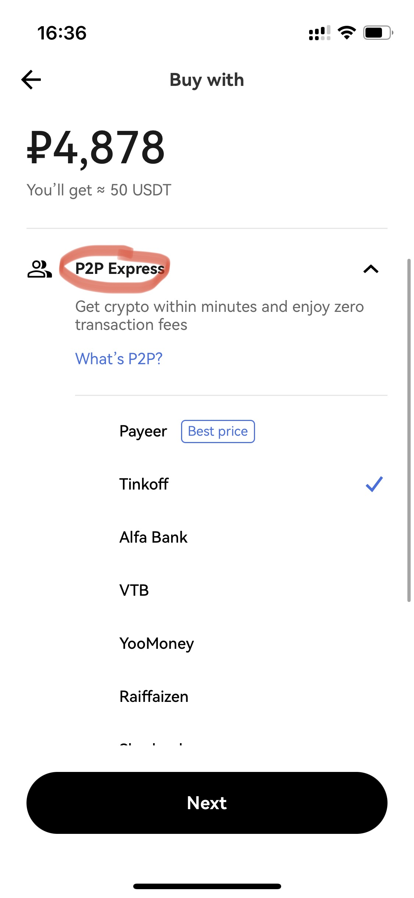
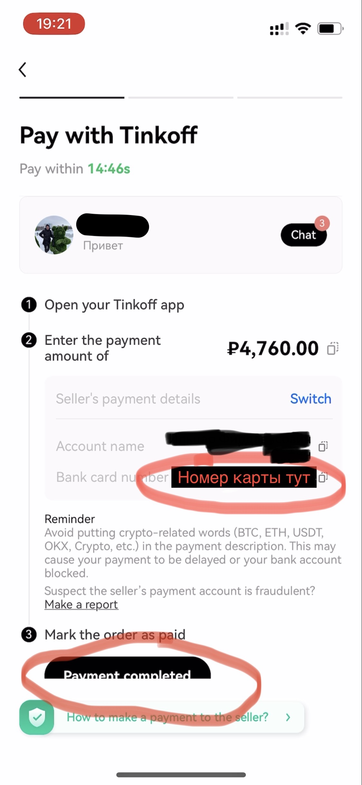

# Переводы рублей в евро криптой

Оказывается, крипта это не только скам,
бинарные опционы и отмыв преступных денег, заработанных с продажи почек детей.
В этом смысле она ничем не лучше и не хуже налички.

В то же время крипта может помочь:

1. Переводить грязные русские деньги между банком РФ и ЕС
  с суммарной комиссией в 1%
2. Защитить деньги от самоуправства банков
  (променяв этот риск на риски мошенничества
  и угрозы компьютерной безопасности)
3. Побаловаться в криптоинвестора, чтобы накопить на чёрный гелик

Здесь я расскажу про переводы на зарубежные счета
(или наоборот, работает аналогично).
Например, как купить USDT за рубли на криптобирже через p2p,
а затем аналогично продать их за евро/доллары/шведские кроны
на Revolut/Wise/WebMoney.

_При этом зарубежный счёт у вас уже должен быть
(это отдельная проблема, и тут я её не касаюсь).
Как альтернатива, после покупки USDT можно прийти в криптообменник
и получить наличку (актуально, например, для жителей Грузии)._

Ни черта непонятно?
Прекрасно, месяц назад для меня это тоже звучало как заклинание.

Пойдём разберёмся с матчастью.

## Матчасть

О том, как устроен блокчейн,
уже прекрасно [рассказал Вастрик](https://vas3k.blog/blog/blockchain/).

Я же сосредоточусь на том,
что необходимо знать для переводов валюты криптой за границу:
о криптобиржах и stablecoins (стейблкоинах)

### Криптобиржа

Когда биткоин только появился, а никаких криптобирж не было,
люди майнили биткоин и пересылали его друг другу лично
на кошельки, в обмен на деньги
или [пиццу](https://vc.ru/crypto/426609-pervaya-pokupka-piccy-za-bitkoin-byla-rovno-12-let-nazad).
Всё бы хорошо, только вот затруднительно каждый раз искать человека,
которому ты доверяешь, кто хочет купить именно 0.001 биткоин
и отдаст за него справедливую цену, — точно так же как искать среди друзей,
кто хочет купить у вас акции Apple или Сбербанка.

Как и в мире акций, в мире крипты эту проблему решили с помощью бирж:
места, куда ты можешь прийти с деньгами,
а уйти ~~без~~ с биткоином, или наоборот.
Биржа заводит свой аккаунт с логином и паролем для каждого пользователя и
создаёт для вас биржевой криптокошелёк (аналог счёта в банке).
Как и в банк, вы можете залогиниться через приложение или браузер.

В целом, крупным биржам можно доверять _почти_ как банкам, однако,
уже известен случай [банкротства криптобиржи FTX](https://ru.wikipedia.org/wiki/FTX_(компания))
с потерей средств держателей счетов. Поэтому:

- Пользуйтесь крупными проверенными биржами
  ([binance](https://www.binance.com/),
  [bybit](https://www.bybit.com/),
  [okx](https://www.okx.com),
  [telegram wallet](https://t.me/wallet))
- Начните с тестового перевода маленькой суммы, чтобы отработать процесс
- Не храните деньги на бирже. Перевели, вывели.

### Stablecoins: USDT, USDC, DAI (криптодоллары)

Вероятно, вы слышали про биткоин и эфир, что они стоят невероятных денег,
но с ними есть одна проблема — они нестабильны.
Сегодня вы купили биткоинов на тысячу рублей,
через час они стали стоить две, а через день — сто.

Тогда люди придумали стейблкоины — криптоденьги,
равные по своему курсу реальной валюте.
На сегодняшний день юзабельны только стейблкоины долларов,
даже криптоевро ещё не получил массового распространения.

Самых известных криптодолларов три: USDC, USDT и DAI.
Первые два почти идентичны
и активно используются биржами для ввода/вывода денег
— их разменивают на реальные доллары.
Третий нас интересовать не будет,
т.к. большинство бирж его для этих целей не используют.

## Перевод денег криптой

Поздравляю, вы осилили матчасть! Дальше будет много практики и скриншотов.

В целом процесс перевода денег через крипту выглядит следующим образом:

- Регистрируемся на бирже и проходим процедуры проверки личности
- Покупаем криптодоллары за ненужные деньги
- Покупаем нужные деньги на криптодоллары,
  либо выводим евро с помощью криптокарты биржи

### Выбор биржи

При выборе биржи я выделил такие ограничивающие условия:

- Биржу устраивает цвет вашего паспорта
- Биржа даёт торговать за рубли
- Биржа даёт возможность вывести деньги на нужный вам банк
- Вам нравится приложенька

Мне нравятся три биржи:

- [bybit](https://www.bybit.com/invite?ref=P6XV6P) —
  умеет рубли, маленькие комиссии,
  для жителей Европы может выпустить банковскую карту,
  с которой удобно пополнять Revolut.
  Номинант на самый неудобный и некрасивый интерфейс среди бирж.
- [bitget](
  https://www.bitget.com/referral/register?from=referral&clacCode=JPT469YA
  ) — вроде тоже умеет рубли, сам пока не пробовал.
  Но хоть какой-то альтернативный вариант.
- [okx](https://okx.com/join/40093369) —
  **С недавних пор запретил рубли в P2P,
  из-за чего его теперь не получится использовать для переводов.**
  Средние комиссии, нет банковской карты.
  Самый удобный и красивый интерфейс,
  поддерживает DeFi кошелёк (для продвинутых криптанов).
- [telegram wallet](https://t.me/wallet) —
  умеет рубли, довольно высокие комиссии, вывод только в сеть Tron.
  Зато не нужно дополнительной проверки по паспорту, как в обычных биржах.
- [Revolut](https://www.revolut.com/crypto/) —
  Это необанк а-ля Тинькофф, доступен только в Европе,
  с недавних пор у него можно в приложении покупать и выводить крипту.
  Комиссии высокие относительно рублёвых сервисов,
  но значительно ниже относительно других европейских сервисов
  для покупки крипты.
  Вывод только в сеть Ethererum (кроме XRP — те можно вывести в Ripple).
- [binance](https://www.binance.info/en/activity/referral-entry/CPA/incremental?ref=CPA_00XERYC5CX)
  — **С недавних пор запретил рубли в P2P,
  из-за чего его теперь не получится использовать для переводов.**.
  Средние комиссии.
  Интерфейс ± на уровне bybit.
  - Для жителей Грузии будет бонусом, что оффлайн-криптообменники
    (где можно за крипту получить наличные доллары)
    обычно имеют аккаунт на бинансе,
    благодаря чему вы сэкономите на внутрибиржевом переводе.

После того как вы выбрали биржу
и скачали приложение по одной из реферальных ссылок выше,
нужно пройти верификацию личности, биржа вас направит.

### Покупка USDT (криптодолларов)

Так как картами РФ нельзя платить на зарубежных сайтах,
а все криптобиржи именно зарубежные,
россияне могут использовать лазейку
(люди, понимающие, как работают торренты сейчас улыбнутся)
— p2p торговля (peer-to-peer, то есть человек-человеку).
Биржа не покупает напрямую ваши рубли,
а лишь выступает посредником между продавцом USDT и рублёвым покупателем.

Процесс выглядит так: после того как вы определитесь с суммой и продавцом,
биржа заблокирует крипту на аккаунте продавца,
вы сделаете перевод рублей из своего банковского приложения
по реквизитам продавца с указанной суммой.
После того как продавец подтвердит получение, биржа зачислит вам крипту.
Если продавец не подтвердит получение денег, вы сможете открыть спор
и прикрепить квитанцию об оплате, и биржа будет решать ваш спор.
Я с таким сталкивался только один раз,
в итоге продавец спустя пару часов перевёл крипту.

В okx процесс выглядит так:

1. Находимся на вкладке Exchange, жмём синюю кнопку снизу

  

  затем `Buy`

  

2. Выбираем USDT для покупки

  

3. Выставляем валюту оплаты RUB

  

4. Прописываем, сколько хотим купить: в рублях или в USDT

  

5. Выбираем P2P торговлю способом покупки (если ещё не выбрана)

  

6. Выбираем способ оплаты: Тинькофф, Сбер, СБП или любой другой удобный

  

7. Подтверждаем размещение заказа на предложенных условиях (курс USDT/рубль).
  После подтверждения вы должны совершить перевод,

8. за незавершённые сделки биржа понизит ваш рейтинг.

  

9. Переходим к экрану платежа

  

10. Копируем реквизиты для платежа (обычно это номер карты и сумма),

11. идём в своё банковское приложение, совершаем платёж

  
  

12. Возвращаемся в приложение биржи, подтверждаем совершённый платёж

  

13. Ждём несколько минут, когда продавец увидит платёж и подтвердит получение

  

14. Крипта зачисляется на ваш счёт

  

  

В bybit процес аналогичный, только сначала нужно зайти в меню,
`More` и выбрать `P2P trade` и по аналогии.

  
Показать скриншоты

  В binance то же самое, нужно сначала войти в pro режим
  (это не за деньги, просто включает усложнённый интерфейс для трейдеров),
  затем выбрать P2P торговлю и по аналогии
  

    
Показать скриншоты

  
  
  

### Выводим евро с криптокарты биржи

На бирже OKX такой способ вывода недоступен, т.к. они не выпускают карт.
Можно, как и в других биржах, вывести через P2P
(смотрите раздел «Или покупаем нужные деньги за криптодоллары»).

Предварительно нужно оформить и получить карту
на [binance](https://www.binance.com/en/cards)
или [bybit](https://www.bybit.com/fiat/cards)
(нужно быть резидентом Европейской страны,
смотрите подробные требования по ссылкам).

Дальше покупаем евро за купленные на предыдущем шаге USDT.
Для этого тыкаем в свежеприобретённые USDT и выбираем `sell`,
вкладка `fiat` (в мире крипты реальные валюты называют фиатными),
выбираем `EUR`, продаём USDT за евро.

Затем заходите в приложение Revolut/Wise/другого банка,
который умеет пополняться еврами с карточки и пополняемся.

Способ подойдёт резидентам Европы и является предпочтительным,
так как перевод будет с карты, выпущенной на ваше имя,
а не какой-то левый человек отправит вам деньги.
Есть мнение, что это вызовет меньше вопросиков со стороны банка.

Имейте в виду, что при крупных переводах
(в районе 10к+ евро, сумма неточная) банки (особенно западные) могут спросить,
откуда у вас эти деньги,
и вам нужно иметь возможность убедительно ответить на этот вопрос.

### Или покупаем нужные деньги за криптодоллары

Если криптокарты у вас нет, можно вывести USDT так же, как и покупали,
с помощью P2P торговли. Только в этот раз нужно не покупать, а продавать.

Кроме того в этом методе можно выбрать любые банк и валюту получения.

Шаги аналогичны покупке USDT,
только на первом шаге вместо `buy` нужно выбрать `sell`.
По пути биржа предложит вам добавить реквизиты банка,
на который вы хотите принимать деньги
(для Revolut это никнейм, для Wise — адрес электронной почты,
для других банков обычно номер карты).

Обычно, если выставить рыночную цену, покупатель появляется уже через минут 10.

Имейте в виду, после выставления крипты на продажу,
когда придёт покупатель, сделает заказ и отправит вам банковский перевод,
нужно будет оперативно (в течение минут 15)
подтвердить перевод в приложении биржи и отпустить крипту.
В противном случае ваш рейтинг могут понизить,
а в итоге даже ограничить участие в P2P.

Готово!

### Покупка крипты в Европе с низкой комиссией

Купить крипты в Европе с низкой комиссией — нетривиальная задача.
Когда я попытался аналогичным образом
через P2P на bybit с переводом на банк Revolut купить крипты,
оказалось, что многие пользуют Revolut из стран,
перевод денег в которые будет мне стоит некоторой дополнительной комиссии.
Я не нашёл способа даже увидеть размер этой комиссии
до того как соглашаешься на P2P заказ в bybit.

Сервисы типа [Moonpay](https://www.moonpay.com/en-gb)
или [Mercuryo](https://mercuryo.io) берут процента 3% комиссии минимум.

Относительно дешёвых вариантов нашёл 2:

- [Биржа Crypto.com](https://crypto.com/app/jwfkfv37yv)
  Можно покупать крипту оплачивая напрямую банковской картой,
  кажется, даже можно выбрать валюту.
  Комиссия низкая, заложена в цену крипты и вывода
- [Биржа OKX](https://okx.com/join/40093369).
  Биржа начала поддерживать входящие SEPA платежи с 0% комиссией.
  Пополняемся с банковского счёта, покупаем крипту и выводим куда надо.
  Комиссия заложена в цену крипты и вывода.
  Сам я SEPA платежи пока не попробовал.
- [Revolut](https://revolut.com/referral/?referral-code=ivanc2xbx!APR2-24-AR).
  У него есть отдельная вкладка с криптой, удобно, если уже пользуешься им.
  Каждая покупка/конвертация/вывод/продажа облагаются комиссией,
  на платных тарифах комиссии ниже или отсутствуют.
  [Тарифы тут](https://www.revolut.com/legal/fees/)

## Криптокарты

Есть сервисы, в которые можно завести крипту
и напрямую тратить с их банковской карты.
Иногда эти же сервисы являются биржей, что позволяет тут же прикупить крипты.

Я пробовал пользоваться [виртуальной и физической криптокартой Bybit](https://www.bybit.com/fiat/cards),
комиссии были годные (в рамках 0-2%).

Карта не поддерживает Apple Pay, но это решается сервисом [Curve](https://www.curve.com).
В нём можно создать виртуальную карту, которую можно добавить в Apple Pay.
Она будет «питаться» с другой банковской карты (вышеупомянутой Bybit).
Таким образом, вы будете платить картой [Curve](https://www.curve.com/join#N3G8AZJD) по Apple Pay с телефона,
а деньги (а вернее крипта) будут списываться с карты Bybit.
Сервис то ли бесплатный, то ли €5 за выпуск карты.

Для россиян доступны
[bitfree](https://www.bitfree.us) и [pyypl](https://www.pyypl.com),
но сам я их не пробовал. По отзывам, уровень их сервиса средненький,
приложухи корявенькие, комиссии высокие. Но это лучшее что есть.

Важный нюанс: если вы планируете потом декларировать эти траты в налоговой,
имейте в виду, что в Европе налоговым ивентом
будет каждый обмен USDT на евро в Bybit.
Чтобы потом не умаяться с копипастой каждого платежа,
рекомендую сразу перевести много USDT в евро в Bybit, и тратить дальше их,
тогда в декларацию пойдёт только одна эта операция.

## Налоги

В разных странах у крипты разный статус. Где-то она запрещена совсем,
где-то имеет особое регулирующее законодательство,
где-то приравнена к ценным бумагам.
Подробного гайда об уплате налогов у меня нет,
лучше проконсультируйтесь с юристом.

Для старта можно прочитать (для РФ и Швеции):

- [Статья про налоги с крипты в РФ](https://vc.ru/legal/639997-chto-nuzhno-znat-o-nalogah-na-kriptu-v-rossii-v-2023-godu)
- [Страница про крипту на сайте налоговой Швеции](https://skatteverket.se/privat/skatter/vardepapper/andratillgangar/kryptovalutor.4.15532c7b1442f256bae11b60.html)

## Крупные суммы

Если вы хотите хотите перевести в Европу крупную сумму денег, например,
от продажи машины или квартиры,
чтобы купить квартиру в ипотеку в Европе,
встанет вопрос о переводе этой суммы в местный банк.

Один из последних оставшихся (а возможно единственный) легальный способ это swift-перевод в Райффайзен банке. По причине того что банк изначально не российский, европейские банки-корреспонденты продолжают с ним сотрудничество, соотвественно ваш перевод не будет отклонен по причине «банк-эмитент зарегистрирован в России, до свидания».

Что нужно для перевода:

1. Счёт в Райффайзен-банке (в идеале прям на ваше имя.
  Круто, если счёт у вас был раньше, но если нет,
  можно чтобы какой-то ваш родственник или друг в России
  открыл счет по доверенности — я делала генеральную доверенность на маму
  и с небольшим скрипом ей удалось открыть счёт на моё имя.
  Если тоже будете так делать и не хотите скрипа,
  поговорите вначале с поддержкой банка,
  чтобы в доверенности была именно нужная им формулировка).
2. Счет в каком-нибудь европейском банке
  (в идеале на ваше имя, например в Bunq, N26, J.P. Morgan или Ziraat Bank.
  Ещё примеры банков, в которые успешно доходят платежи из Райффайзена,
  можно посмотреть [тут](https://ohmyswift.ru/bank/%D0%90%D0%9E%20%D0%A0%D0%90%D0%99%D0%A4%D0%A4%D0%90%D0%99%D0%97%D0%95%D0%9D%D0%91%D0%90%D0%9D%D0%9A))
3. Минимум 20к евро ([это условие самого Райффайзена](https://www.raiffeisen.ru/about/press/news/201926/)).
  Также рассчитывайте на то, что вам придется попрощаться с ~[400-1000 евро](https://www.raiffeisen.ru/about/press/news/201939/),
  которые в качестве комиссии банка-отправителя,
  посредников и получателей будут удержаны из суммы вашего перевода.
4. Готовность объяснить откуда у вас деньги
  (коротко это потребуется указать уже в описании перевода.
  Если в процессе перевода что-то вызовет подозрения
  у банка-получателя или посредников, с вами свяжутся
  и попросят доказать происхождение денег или, например,
  родство с человеком, на чьё имя вы делаете перевод).

В идеальной ситуации все счета открыты на ваше имя,
вы делаете перевод самому себе, что не вызывает вопросов у банка, вуаля,
в течение максимум пары-тройки дней вам на счёт приходит вся сумма целиком,
всё по-белому, даже не стыдно в налоговой показать.

Я так переводила весной 2023 сама себе на счёт в немецком N26.
В течение, кажется, пары суток деньги дошли
без каких-либо вопросов со стороны банка, с комиссией 1,5%
(что кажется дофига относительно суммы перевода,
но ещё по-божески относительно того, какая комиссия стала с февраля 2024).

---
Автор [@skatromb](https://t.me/skatromb), соавторка раздела "Крупные суммы" [@aldohha](https://t.me/aldohha)
